# LanFund - 基金市场辅助工具


一个功能强大的金融市场实时监控工具，支持命令行和Web两种模式，兼容移动端，可追踪基金估值、市场指数、黄金价格、行业板块和市场快讯。

体验地址: [http://lanfund.xyz34.fan:8311/](http://lanfund.xyz34.fan:8311/)
> 小服务器经不起折腾, 轻点

> 账号体系为了区分每个人自己的持仓, 用于导出配置文件功能使用

> 为了部署简单没做前后端分离

## 2026.02.09 更新

- 增加黄金分时统计图
- cli 模式同步服务器配置(修改份额、修改自选等无需操作两次)

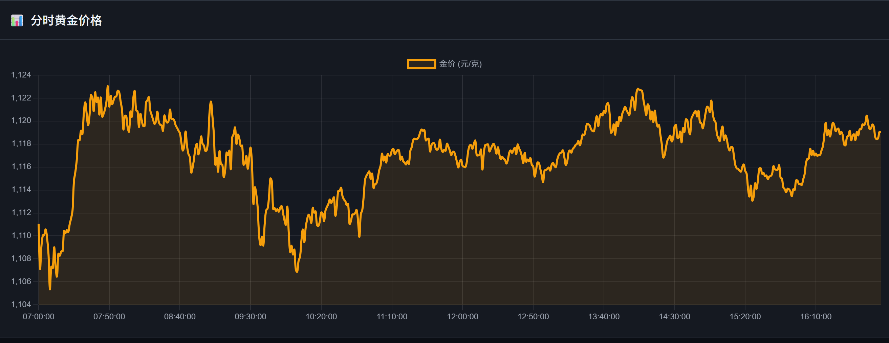

### CLI 模式服务器同步配置

CLI 模式现在支持从服务器自动同步基金配置，实现多端数据一致性。

#### 初始化服务器连接

首次使用需要初始化服务器连接配置：

```bash
python fund.py --init / fund.exe --init
```

按提示输入：
- 服务器地址（默认: `http://localhost:8311`） (体验地址为: http://lanfund.xyz34.fan:8311 先注册账号)
- 用户名
- 密码

程序会自动验证连接并保存配置到 `cache/user_account.json`。

#### 自动同步

初始化完成后，所有操作都会自动同步到服务器：

```bash
# 从服务器加载配置并查看
python fund.py

# 添加基金（自动同步到服务器）
python fund.py -a

# 删除基金（自动同步到服务器）
python fund.py -d

# 标记持有（自动同步到服务器）
python fund.py -c

# 修改份额（自动同步到服务器）
python fund.py -m
```

#### 配置文件格式

`cache/user_account.json` 存储格式：

```json
{
    "server_url": "http://192.168.1.100:8311",
    "username": "your_username",
    "password": "your_password",
    "last_sync": "2026-02-09T16:30:00"
}
```

#### 多端使用场景

1. **在家用电脑**：通过 Web 界面（`http://localhost:8311`）添加基金、设置份额
2. **在公司用 CLI**：自动同步家里的配置，无需重复设置
3. **移动办公**：任何设备运行 CLI 都会获取最新配置

#### 故障降级

如果服务器连接失败，程序会自动降级到本地文件模式（`cache/fund_map.json`），确保功能可用。

## 2026.02.05 更新

- 上证分时移动到市场行情页面
- 增加基金今日估值走势图

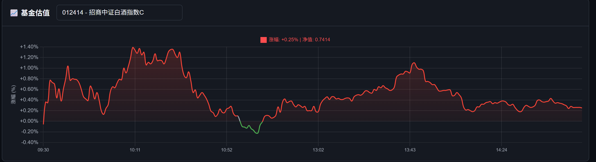

## ✨ 最新功能

- 🏷️ **板块标注**: 支持为基金添加多个板块标签，便于分类管理
- 📊 **持仓统计**: Web 端支持显示持仓金额、预估收益、实际收益等详细统计
- ✨ **一键炫耀**: 持仓统计页面炫酷卡片生成功能，支持截图分享今日收益
- 💾 **数据导入导出**: 支持导出/导入基金配置，方便跨设备同步

## 运行截图

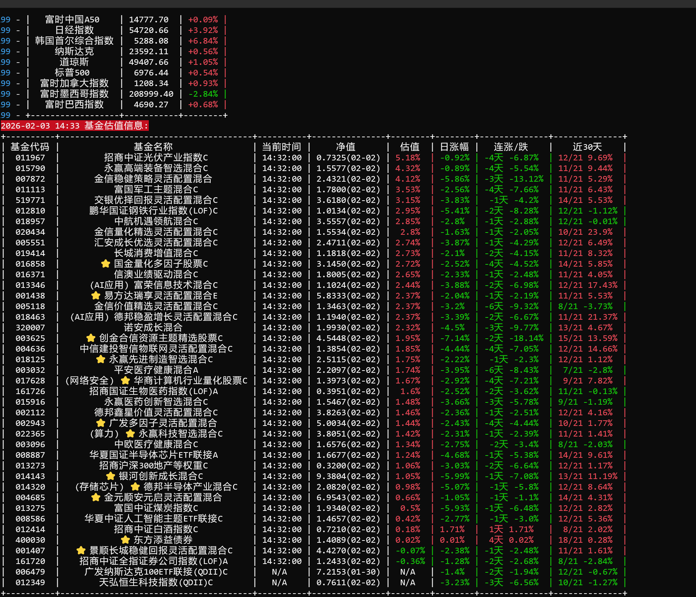

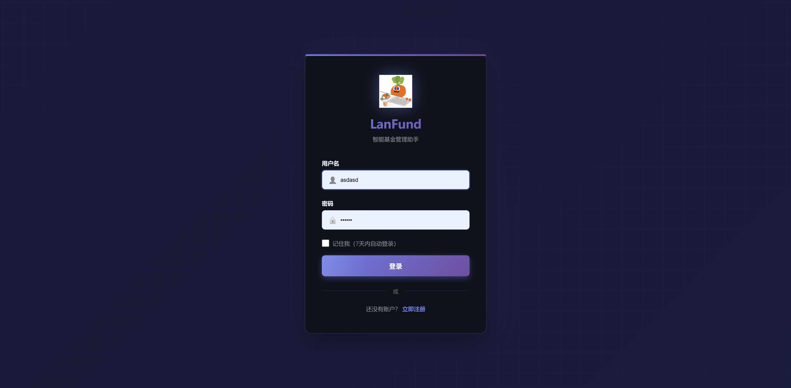

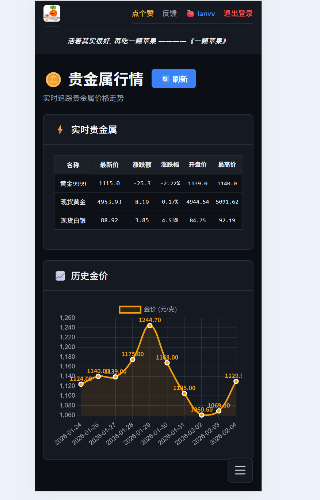

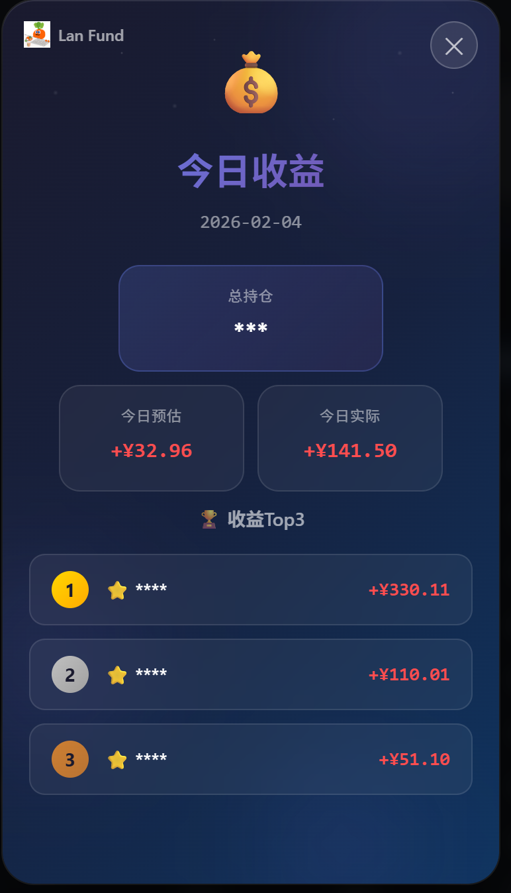

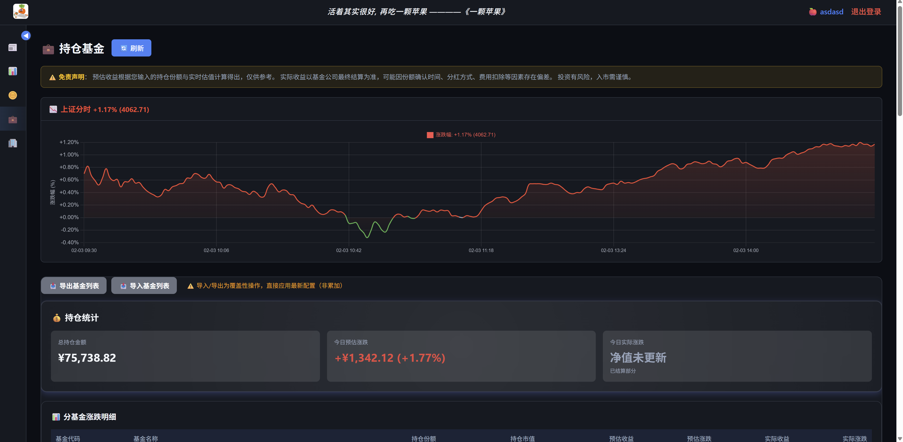

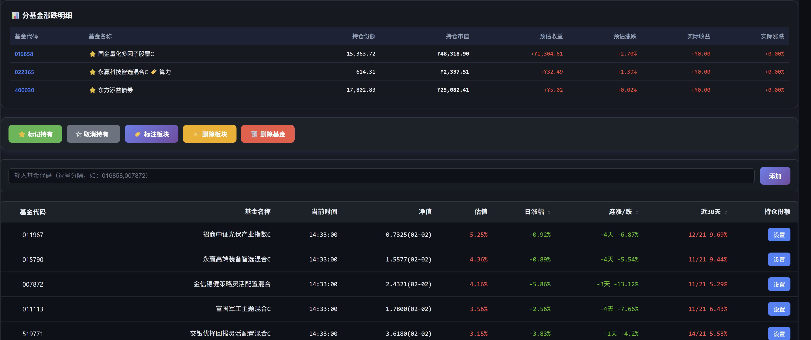

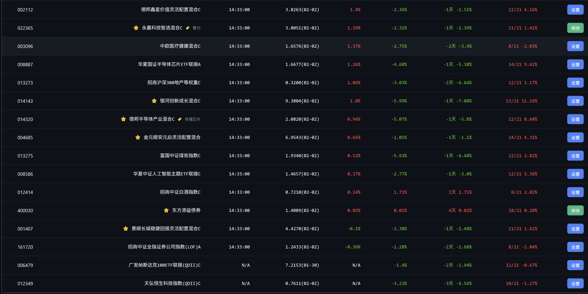

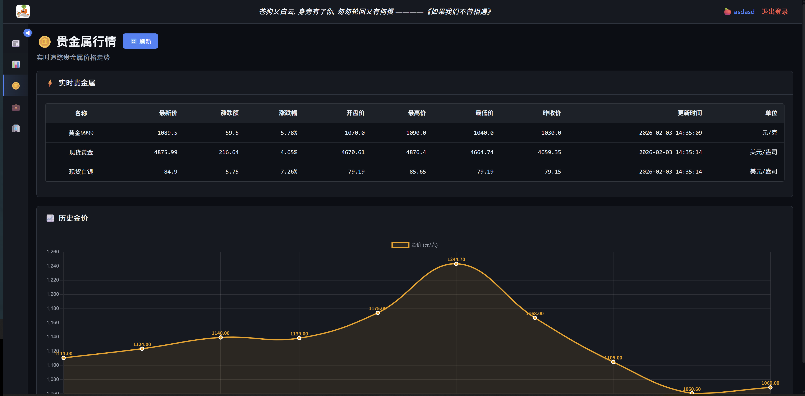

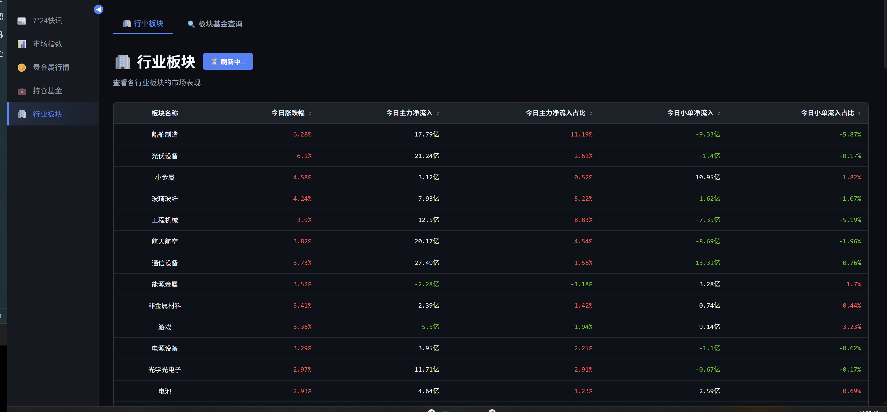


## 功能特性

### 数据监控

- **基金实时估值**：实时更新基金估值、日涨幅、近30天涨跌趋势
- **市场指数**：上证指数、深证指数、创业板指、纳斯达克、道琼斯等
- **黄金价格**：中国黄金基础金价、周大福金价及历史数据
- **行业板块**：各行业板块涨跌幅、主力资金流入情况
- **7×24快讯**：实时金融市场新闻

### 智能分析

- **连涨/连跌分析**：自动计算基金连续涨跌天数和幅度
- **30天趋势**：展示近30天涨跌分布，一目了然
- **持仓标记**：支持标记持有基金（⭐显示），快速关注重点
- **彩色显示**：终端下红涨绿跌，直观易读

### 双模式运行

- **命令行模式**：快速查看，适合终端用户
- **Web界面模式**：可视化展示，支持表格排序，适合浏览器访问

### 💡 使用建议

**推荐工作流程**：

1. **Web 端首次配置**：建议所有用户（包括 CLI 用户）首次使用时通过 Web 界面进行配置
    - 访问 `http://localhost:8311` 进行注册/登录
    - 在 Web 界面添加基金、标记持有、标注板块、设置份额
    - 配置完成后使用"导出基金列表"功能下载配置文件

2. **CLI 用户同步配置**：
   ```bash
   # 将导出的 fund_map.json 复制到 cache 目录
   cp fund_map.json cache/fund_map.json

   # 之后即可在 CLI 模式下使用配置
   python fund.py
   ```

**特性**：

- Web 界面操作更直观，避免手动输入错误
- 可视化选择板块，无需记忆板块编号
- 支持批量操作，一次性完成多只基金的配置
- 配置可跨设备共享，多端同步

## 安装

### 依赖安装

```bash
pip install -r requirements.txt
```

### 依赖包说明

- `loguru` - 日志输出
- `requests` - HTTP请求
- `tabulate` - 表格格式化
- `flask` - Web服务器（仅Web模式需要）
- `curl-cffi` - 浏览器模拟请求
- `langchain` - AI提示链框架（AI分析功能）
- `langchain-openai` - OpenAI兼容API支持
- `langchain-core` - LangChain核心组件

## 使用方法

### 命令行模式

#### 查看所有信息

```bash
python fund.py
```

或使用编译好的可执行文件：

```bash
./dist/fund.exe  # Windows
```

显示内容包括：

- 7×24快讯
- 行业板块排行
- 实时金价
- 黄金历史价格
- 近7日A股成交量
- 近30分钟上证指数
- 市场指数汇总
- 预估收益
- 自选基金估值

#### 管理自选基金

**添加基金**

```bash
python fund.py -a
# 根据提示输入基金代码，多个代码用英文逗号分隔
# 例如：001618,161725,110011
```

**删除基金**

```bash
python fund.py -d
# 根据提示输入要删除的基金代码
```

**标记持有基金**

```bash
python fund.py -c
# 标记后的基金会在名称前显示 ⭐
```

**取消持有标记**

```bash
python fund.py -b
# 移除基金的持有标记
```

**标记基金板块**（独立功能）

```bash
python fund.py -e
# 为基金添加板块标签，独立于持有标记
# 标记后会在基金名称中显示板块信息
```

**删除板块标记**

```bash
python fund.py -u
# 删除基金的板块标签
```

**查询基金板块**

```bash
python fund.py -s
# 输入板块名称关键词，程序会列出相关的板块
# 然后可以选择具体的板块查看该板块下的基金列表
```

**修改基金持仓份额**

```bash
python fund.py -m
# 根据提示输入基金代码和持仓份额
# 用于设置每只基金的持有份额，用于计算收益统计
```

### AI分析命令

#### 启用AI分析

```bash
# 启用AI分析（必须使用 -W 参数）
python fund.py -W           # 标准分析模式（~1200-1600字）
python fund.py -f -W        # 快速分析模式（~400-500字）
python fund.py -F -W        # 快速分析模式（备用参数）
python fund.py -D -W        # 深度研究模式（ReAct Agent，10000+字）
python fund.py --deep -W    # 深度研究模式（备用参数）

# 注意：不使用 -W 参数时，默认不进行AI分析
```

#### 输出AI报告到文件

```bash
python fund.py -o           # 保存到 reports/ 目录
python fund.py -o custom    # 保存到 custom/ 目录
```

### Web服务器模式

#### 启动服务

```bash
python fund_server.py
```

服务默认运行在：`http://0.0.0.0:8311`

#### 访问地址

浏览器访问：`http://localhost:8311/fund`

#### Web 操作功能

在"自选基金"页面，可以直接通过页面操作基金：

**添加自选基金**
**删除自选基金**
**标记持有基金**
**标注板块**
**设置持仓份额**
**一键炫耀（分享收益卡片）**

## 打包为可执行文件

使用 PyInstaller 将程序打包为独立的可执行文件：

```bash
pyinstaller fund.spec
```

打包完成后，可执行文件位于 `dist/fund.exe`（Windows）或 `dist/fund`（Linux/Mac）。

## Docker 部署

### 构建镜像

```bash
docker build -t lanfund .
```

### 运行容器

```bash
# 基础运行
docker run -d -p 8311:8311 --name lanfund lanfund

# 带数据持久化（推荐）
docker run -d -p 8311:8311 --name lanfund -v /cache:/app/cache lanfund


### 常用命令

```bash
# 查看日志
docker logs -f lanfund

# 停止容器
docker stop lanfund

# 启动已停止的容器
docker start lanfund

# 删除容器
docker rm lanfund

# 删除镜像
docker rmi lanfund
```

访问地址：`http://localhost:8311`

## AI智能分析（可选）

程序集成了最新版本的**LangChain (0.3.27+)**，使用**提示链（Prompt Chain）模式**生成深度AI分析报告。

### 三种分析模式

程序支持三种不同的AI分析模式，满足不同场景需求：

#### 标准模式（默认）

```bash
python fund.py -W      # 启用AI分析
```

- **输出长度**：1,200-1,600字（4个维度 × 300-400字）
- **生成时间**：2-3分钟
- **token消耗**：4,000-6,000
- **适用场景**：日常快速查看，平衡速度和质量

#### 快速模式

```bash
python fund.py -f -W   # 快速分析
# 或
python fund.py -F -W
```

- **输出长度**：400-500字（简明报告）
- **生成时间**：30-60秒
- **token消耗**：~1,000
- **适用场景**：快速浏览市场概况，节省成本

#### 深度研究模式

```bash
python fund.py -D -W   # 深度研究模式
# 或
python fund.py --deep -W
```

- **输出长度**：10,000-12,000字（专业行研报告）
- **生成时间**：5-10分钟
- **token消耗**：~20,000
- **成本**：约为标准模式的**6倍**
- **特色功能**：
    - 🤖 **ReAct Agent自主研究**：Agent自主决定数据收集策略
    - 🌍 **多源信息交叉验证**：使用DuckDuckGo搜索国际媒体报道
    - 📰 **网页深度抓取**：获取完整新闻文章内容
    - 🔍 **官方vs市场视角对比**：明确区分官方快讯与独立媒体观点
    - 📊 **详尽的量化分析**：每个事件500-1000字深度解读
    - 💼 **具体操作计划**：可执行的交易策略和触发条件
- **适用场景**：周末复盘、重要决策前的全面研究、专业投资分析

**模式对比表**：

| 特性    | 快速模式    | 标准模式         | 深度研究模式        |
|-------|---------|--------------|---------------|
| 字数    | 400-500 | 1,200-1,600  | 10,000-12,000 |
| 时间    | 30-60秒  | 2-3分钟        | 5-10分钟        |
| Token | ~1,000  | ~4,000-6,000 | ~20,000       |
| 成本    | ¥0.002  | ¥0.01-0.02   | ¥0.06-0.12    |
| 信息源   | 本地数据    | 本地数据         | 本地+网络搜索       |
| 分析深度  | 概要      | 标准           | 专业级           |

### 配置方式

#### 方式1：使用.env文件（推荐）

创建 `.env` 文件：

```bash
LLM_API_KEY=your-api-key
LLM_API_BASE=https://api.moonshot.cn/v1
LLM_MODEL=moonshot-v1-8k
```

或者使用DeepSeek：

```bash
LLM_API_KEY=your-api-key
LLM_API_BASE=https://api.deepseek.com/v1
LLM_MODEL=deepseek-chat
```

#### 方式2：临时配置

```bash
export LLM_API_KEY="your-api-key"
export LLM_API_BASE="https://api.deepseek.com/v1"
export LLM_MODEL="deepseek-chat"

python3 fund.py
```

#### 方式3：永久配置

在 `~/.bashrc` 或 `~/.zshrc` 添加：

```bash
export LLM_API_KEY="your-api-key"
export LLM_API_BASE="https://api.deepseek.com/v1"
export LLM_MODEL="deepseek-chat"
```

然后 `source ~/.bashrc` 生效。

### 支持的AI服务

OpenAI兼容格式，推荐标准模式用thinking模型，深度研究模式使用控制工具厉害的模型如claude-sonnet或kimi-k2

## 免责声明

本工具仅提供数据展示功能，不构成任何投资建议。投资有风险，入市需谨慎。

---

